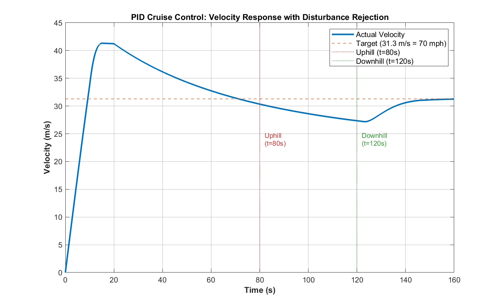
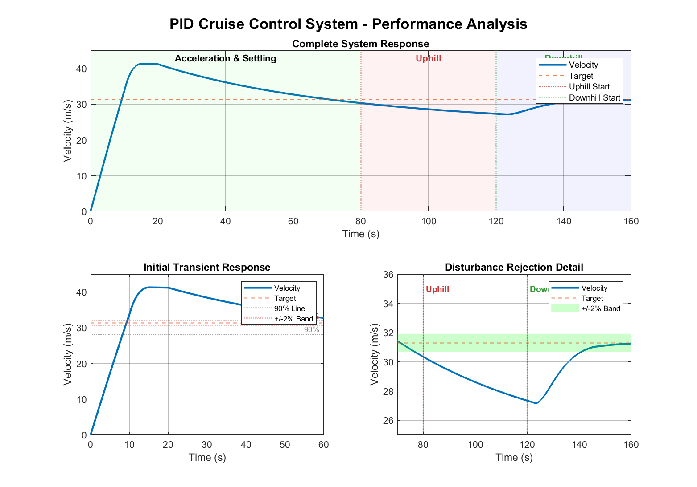
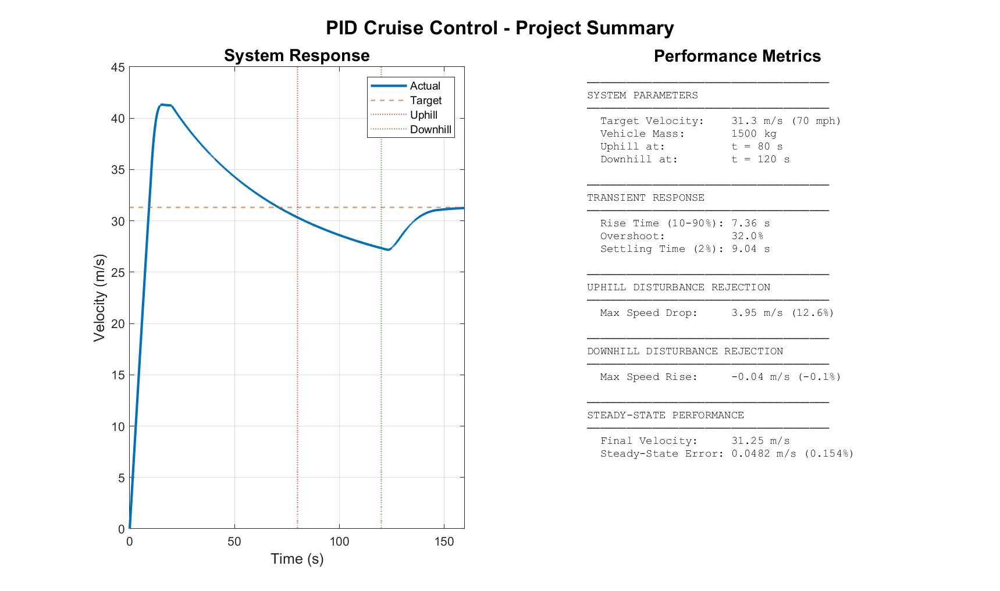

# PID Cruise Control System with Disturbance Rejection

[](https://www.mathworks.com/products/matlab.html)
[](https://www.mathworks.com/products/simulink.html)
[](LICENSE)

A MATLAB/Simulink implementation of a PID-based cruise control system demonstrating vehicle speed regulation and disturbance rejection. Developed as part of an MEng Automotive Engineering portfolio project.



---

## Table of Contents

- [Overview](#overview)
- [Features](#features)
- [System Architecture](#system-architecture)
- [Getting Started](#getting-started)
- [Usage](#usage)
- [Results](#results)
- [Performance Metrics](#performance-metrics)
- [Project Structure](#project-structure)
- [Theory](#theory)
- [Future Improvements](#future-improvements)
- [Author](#author)

---

## Overview

This project implements a closed-loop cruise control system that maintains a target vehicle speed of **70 mph (31.3 m/s)** while rejecting external disturbances such as uphill and downhill gradients. The system uses a PID (Proportional-Integral-Derivative) controller to regulate engine force based on the velocity error.

### Key Objectives

- Maintain constant vehicle speed despite varying road conditions
- Demonstrate disturbance rejection capabilities
- Achieve minimal steady-state error
- Provide smooth, realistic vehicle response

---

## Features

- **Realistic Vehicle Dynamics Model**
  - Aerodynamic drag (proportional to v²)
  - Rolling resistance
  - Vehicle mass and inertia

- **PID Control Implementation**
  - Proportional, Integral, and Derivative control actions
  - Tuneable gains for optimised performance
  - Engine force saturation limits (0-5000N)

- **Disturbance Rejection**
  - Uphill gradient simulation (speed drop and recovery)
  - Downhill gradient simulation (speed rise and recovery)

- **Publication-Quality Visualisation**
  - Automated plot generation
  - Performance metrics calculation
  - High-resolution figure export (300 DPI)

---

## System Architecture

```
                    ┌─────────────────────────────────────────────────────────┐
                    │                   CRUISE CONTROL SYSTEM                  │
                    └─────────────────────────────────────────────────────────┘
                    
    ┌─────────┐     ┌─────────┐     ┌─────────┐     ┌─────────┐     ┌─────────┐
    │ Target  │     │  Error  │     │   PID   │     │ Engine  │     │ Vehicle │
    │ Speed   │────▶│   Sum   │────▶│Controller────▶│Saturation────▶│ Plant   │
    │ 31.3m/s │     │  (Σ)    │     │         │     │ 0-5000N │     │         │
    └─────────┘     └────┬────┘     └─────────┘     └─────────┘     └────┬────┘
                        │                                                │
                        │              ┌─────────────┐                   │
                        │              │ Disturbances│                   │
                        │              │ • Hill Force│                   │
                        │              │ • Drag      │                   │
                        │              │ • Rolling R │                   │
                        │              └──────┬──────┘                   │
                        │                     │                          │
                        │                     ▼                          │
                        │              ┌─────────────┐                   │
                        └──────────────│   Velocity  │◀──────────────────┘
                         Feedback      │   Output    │
                                       └─────────────┘
```

### Simulink Block Diagram

The model consists of the following main components:

| Block | Function |
|-------|----------|
| **Target Velocity** | Constant reference speed (31.3 m/s) |
| **Error Calculation** | Computes difference between target and actual velocity |
| **PID Controller** | Generates control signal based on error |
| **Engine Force Limiter** | Saturates force between 0-5000N |
| **Vehicle Plant** | Integrates forces to compute velocity |
| **Drag Model** | Calculates aerodynamic drag (∝ v²) |
| **Rolling Resistance** | Constant opposing force |
| **Hill Disturbance** | Step input simulating uphill gradient |
| **Downhill Disturbance** | Step input simulating downhill gradient |

---

## Getting Started

### Prerequisites

- MATLAB R2023b or later
- Simulink
- Control System Toolbox (optional, for advanced analysis)

### Installation

1. Clone the repository:
   ```bash
   git clone https://github.com/YOUR_USERNAME/pid-cruise-control-simulink.git
   cd pid-cruise-control-simulink
   ```

2. Open MATLAB and navigate to the project directory.

3. Run the initialisation script:
   ```matlab
   cruise_control_init
   ```

---

## Usage

### Running the Simulation

1. **Initialise parameters:**
   ```matlab
   cruise_control_init
   ```

2. **Open and run the Simulink model:**
   ```matlab
   open_system('simulink_cruise_control_system')
   sim('simulink_cruise_control_system')
   ```
   
   Or simply press the **Run** button in Simulink.

3. **Generate analysis plots:**
   ```matlab
   cruise_control_plots
   ```

### Customising Parameters

Edit `cruise_control_init.m` to modify:

```matlab
% Vehicle Parameters
m = 1500;           % Vehicle mass [kg]
Cd = 0.3;           % Drag coefficient
A = 2.2;            % Frontal area [m²]
Crr = 0.015;        % Rolling resistance coefficient

% Control Parameters
Kp = 500;           % Proportional gain
Ki = 50;            % Integral gain
Kd = 100;           % Derivative gain

% Target
v_target = 31.3;    % Target velocity [m/s] (70 mph)
```

---

## Results

### Complete System Response



The system demonstrates:

1. **Acceleration Phase (0-60s):** Vehicle accelerates from rest to target speed with controlled overshoot
2. **Uphill Phase (80-120s):** Velocity dips due to hill resistance, then recovers
3. **Downhill Phase (120-160s):** System maintains stability during downhill assist

### Performance Summary



---

## Performance Metrics

### Transient Response

| Metric | Value | Description |
|--------|-------|-------------|
| **Rise Time (10-90%)** | 7.36 s | Time to reach 90% of target |
| **Peak Overshoot** | 32.0% | Maximum deviation above target |
| **Settling Time (2%)** | 9.04 s | Time to enter ±2% band |

### Disturbance Rejection

| Disturbance | Time | Effect | Recovery |
|-------------|------|--------|----------|
| **Uphill** | t = 80s | -3.95 m/s (12.6% drop) | Returns to target |
| **Downhill** | t = 120s | -0.04 m/s (-0.1%) | Minimal effect |

### Steady-State Performance

| Metric | Value |
|--------|-------|
| **Final Velocity** | 31.25 m/s |
| **Steady-State Error** | 0.048 m/s (0.15%) |

---

## Project Structure

```
pid-cruise-control-simulink/
│
├── cruise_control_init.m          # Parameter initialisation script
├── cruise_control_plots.m         # Publication-quality plotting script
├── simulink_cruise_control_system.slx  # Main Simulink model
├── README.md                      # This file
│
└── cruise_control_figures/        # Generated figures
    ├── fig1_velocity_response.png
    ├── fig1_velocity_response_hires.png
    ├── fig1_velocity_response.fig
    ├── fig2_detailed_analysis.png
    ├── fig2_detailed_analysis_hires.png
    ├── fig2_detailed_analysis.fig
    ├── fig3_summary_dashboard.png
    ├── fig3_summary_dashboard_hires.png
    └── fig3_summary_dashboard.fig
```

---

## Theory

### Vehicle Dynamics Model

The vehicle is modelled using Newton's second law:

$$m \frac{dv}{dt} = F_{engine} - F_{drag} - F_{roll} - F_{hill}$$

Where:
- **F_drag** = ½ρCdAv² (Aerodynamic drag)
- **F_roll** = Crr × m × g (Rolling resistance)
- **F_hill** = m × g × sin(θ) (Gradient force)

### PID Controller

The PID controller output is:

$$F_{engine} = K_p \cdot e(t) + K_i \int e(t)dt + K_d \frac{de(t)}{dt}$$

Where e(t) = v_target - v_actual

### Control Parameters

| Parameter | Value | Effect |
|-----------|-------|--------|
| **Kp = 500** | Proportional gain | Reduces rise time, may increase overshoot |
| **Ki = 50** | Integral gain | Eliminates steady-state error |
| **Kd = 100** | Derivative gain | Reduces overshoot, improves stability |

---

## Future Improvements

- [ ] Implement anti-windup compensation for integral term
- [ ] Add engine braking capability (negative force)
- [ ] Model realistic hill approach (gradual gradient change)
- [ ] Include wind disturbance effects
- [ ] Implement gain scheduling for different speed ranges
- [ ] Add traction limit modelling
- [ ] Create hardware-in-the-loop (HIL) test capability

---

## Author

**Kyle Ware**

Personal Project by MEng Automotive Engineering Student

Loughborough University

---

## License

This project is licensed under the MIT License - see the [LICENSE](LICENSE) file for details.

---

## Acknowledgements

- MATLAB and Simulink by MathWorks
- Control systems theory references from course materials

---

*Last updated: January 2026*
