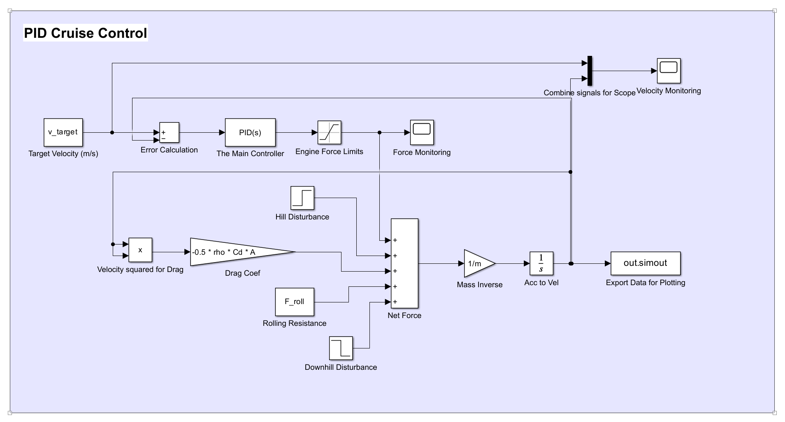

# PID Cruise Control System with Disturbance Rejection

[](https://www.mathworks.com/products/matlab.html)
[](https://www.mathworks.com/products/simulink.html)

A MATLAB/Simulink implementation of a PID-based cruise control system demonstrating vehicle speed regulation and disturbance rejection.


---

## About This Project

I built this project to deepen my understanding of control systems and vehicle dynamics as part of my MEng Automotive Engineering studies. The goal was to design a cruise control system from scratch that could maintain a target speed while handling real-world disturbances like hills.

### What I Learned

- Implementing closed-loop feedback control in Simulink
- Modelling vehicle dynamics (drag, rolling resistance, mass)
- Tuning PID gains to balance response speed vs. stability
- Analysing system performance using standard metrics
- Creating publication-quality technical visualisations in MATLAB

---

## Project Overview

The system maintains a target vehicle speed of **70 mph (31.3 m/s)** while rejecting external disturbances such as uphill and downhill gradients. A PID controller regulates engine force based on the velocity error.

### Key Features

- **Realistic Vehicle Model** - Includes aerodynamic drag (∝ v²), rolling resistance, and vehicle inertia
- **PID Control** - Tuneable proportional, integral, and derivative gains
- **Disturbance Rejection** - Handles both uphill and downhill gradients
- **Automated Analysis** - MATLAB script generates publication-quality plots and calculates performance metrics

---

## Simulink Model



### System Components

| Block | Function |
|-------|----------|
| **Target Velocity** | Constant reference speed (31.3 m/s) |
| **Error Calculation** | Difference between target and actual velocity |
| **PID Controller** | Generates control signal (Kp=500, Ki=50, Kd=100) |
| **Engine Saturation** | Limits force to realistic range (0-5000N) |
| **Vehicle Plant** | Integrates net force to compute velocity |
| **Drag & Rolling Resistance** | Opposing forces acting on vehicle |
| **Hill/Downhill Disturbance** | Step inputs simulating road gradients |

---

## Results

### System Response


The simulation demonstrates three phases:

1. **Acceleration (0-60s)** - Vehicle accelerates from rest with controlled overshoot
2. **Uphill (80-120s)** - Velocity dips due to gradient resistance, then recovers
3. **Downhill (120-160s)** - System maintains stability during downhill assist

### Performance Summary


---

## Performance Metrics

### Transient Response

| Metric | Value |
|--------|-------|
| Rise Time (10-90%) | 7.36 s |
| Peak Overshoot | 32.0% |
| Settling Time (2%) | 9.04 s |

### Disturbance Rejection

| Disturbance | Effect |
|-------------|--------|
| Uphill (t=80s) | 3.95 m/s drop (12.6%), full recovery |
| Downhill (t=120s) | Minimal effect (-0.1%) |

### Steady-State

| Metric | Value |
|--------|-------|
| Final Velocity | 31.25 m/s |
| Steady-State Error | 0.048 m/s (0.15%) |

---

## How to Run

### Prerequisites

- MATLAB R2023b or later
- Simulink

### Steps

1. Clone this repository:
   ```bash
   git clone https://github.com/YOUR_USERNAME/pid-cruise-control-simulink.git
   ```

2. Open MATLAB and navigate to the project folder

3. Run the simulation:
   ```matlab
   cruise_control_init          % Load parameters
   sim('simulink_cruise_control_system')  % Run simulation
   cruise_control_plots         % Generate analysis plots
   ```

---

## Project Structure

```
├── cruise_control_init.m              # Parameter initialisation
├── cruise_control_plots.m             # Plotting and analysis script
├── simulink_cruise_control_system.slx # Simulink model
├── README.md
│
└── cruise_control_figures/
    ├── fig1_velocity_response.png
    ├── fig2_detailed_analysis.png
    ├── fig3_summary_dashboard.png
    └── simulink_model.png
```

---

## Technical Details

### Vehicle Dynamics

The vehicle is modelled using Newton's second law:

$$m \frac{dv}{dt} = F_{engine} - F_{drag} - F_{roll} - F_{hill}$$

| Force | Equation | Description |
|-------|----------|-------------|
| Drag | ½ρCdAv² | Aerodynamic resistance |
| Rolling | Crr × m × g | Tyre-road friction |
| Hill | m × g × sin(θ) | Gradient force |

### Vehicle Parameters

| Parameter | Value |
|-----------|-------|
| Mass | 1500 kg |
| Drag Coefficient | 0.3 |
| Frontal Area | 2.2 m² |
| Rolling Resistance | 0.015 |

### PID Gains

| Gain | Value | Purpose |
|------|-------|---------|
| Kp | 500 | Reduces rise time |
| Ki | 50 | Eliminates steady-state error |
| Kd | 100 | Reduces overshoot |

---

## Future Improvements

If I continue developing this project, I'd like to add:

- [ ] Anti-windup compensation for the integral term
- [ ] Engine braking capability (negative force)
- [ ] Gradual hill transitions instead of step inputs
- [ ] Wind disturbance modelling
- [ ] Gain scheduling for different speed ranges
- [ ] Comparison with other control strategies (MPC, adaptive control)

---

## Contact

**Kyle Ware**

- 📧 Email: [kyle.ware@outlook.com]
- 💼 LinkedIn: [linkedin.com/in/kyleaware/]
- 🎓 MEng Automotive Engineering

Feel free to reach out if you have questions about this project!

---

*Built with MATLAB & Simulink | January 2026*
